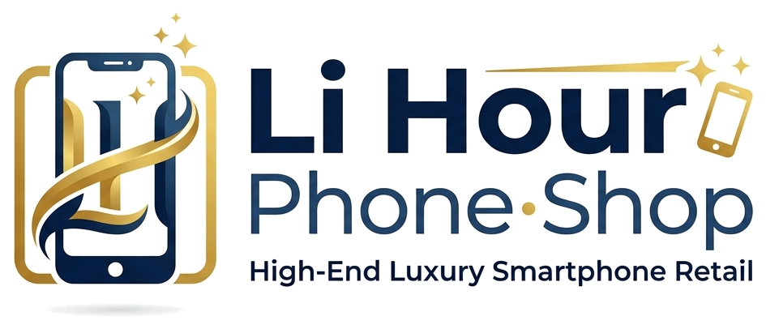
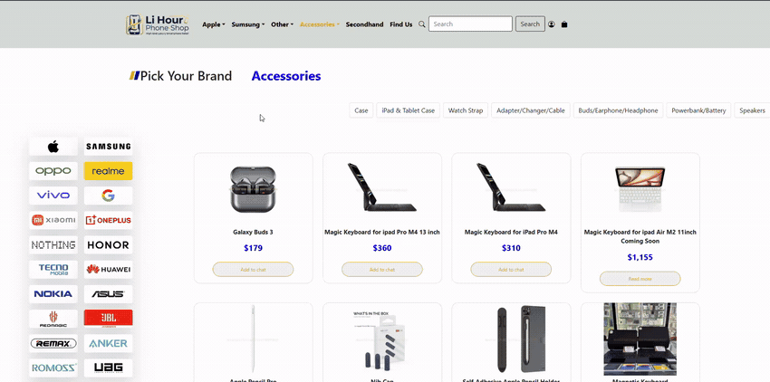

<p align="center">
  
</p>

<h1 align="center">Li Hour Phone Shop (ហាងទូរស័ព្ទ លីហួរ)</h1>

<p align="center">
  <strong>A Responsive E-Commerce Smartphone & Electronics Storefront</strong><br>
  <em>Year 2 Web Development Project — Built with Bootstrap 5, HTML5, and CSS3</em>
</p>

<p align="center">
  
  
  
  
</p>

---

## 📖 Executive Summary

Welcome to the **Li Hour Phone Shop** repository. This project was conceptualized and developed during my **Year 2 University Web Development coursework** to master modern front-end web design, grid layouts, and component-based UI engineering. 

The goal of this project was to construct a real-world, user-centric e-commerce storefront tailored for a consumer electronics and smartphone retailer in Cambodia. It emphasizes responsive layouts, consistent brand identity, intuitive navigation, and rich visual product presentation across diverse device viewports.

---

## 🎥 Live Video Walkthrough

A full feature and responsive walkthrough is included directly in this repository:

https://github.com/user-attachments/assets/demo.mp4

> **Direct File:** You can also watch or download the recording locally: [`demo.mp4`](demo.mp4) (11.2 MB).

<p align="center">
  
</p>

<p align="center">
  <strong>🎬 Live Walkthrough Demo</strong> &mdash; <em>Responsive catalog layout, brand identity, and interactive navigation.</em><br>
  <a href="demo.mp4">▶ Download / View Full High-Res Video (demo.mp4)</a>
</p>

---

## ✨ Key Features & Functionality

### 1. Multi-Tier Product Catalogues
- **Apple Flagship Showcase (`index.html`):** Features the latest iPhone lineups (iPhone 16 Pro Max, 16 Plus), iPad Pro, and MacBook models with dynamic cards, pricing, and visual specs.
- **Samsung Galaxy Hub (`Accessories/Samsung.html`):** Categorized view for Galaxy S series, Note series, A series, Galaxy Tabs, and Galaxy Buds.
- **Audio & Third-Party Gear (`Accessories/other.html`):** Dedicated showcases for verified third-party accessories including JBL Bluetooth speakers and Remax power banks.
- **Universal Accessories Center (`Accessories/accessories.html`):** Deep categorization covering chargers, tempered glass protectors, phone cases, and high-capacity battery packs.

### 2. Secondhand & Trade-In Marketplace (`Accessories/Secondhand.html`)
- Structured display for certified pre-owned devices, promoting sustainable electronics purchasing with clear visual condition cues and competitive pricing.

### 3. Physical Storefront Locator & Contact (`Accessories/Find_us.html`)
- Store location coordinates, customer support phone lines, and one-click Telegram community integration for immediate customer inquiry.

### 4. User Authentication UI (`Accessories/singin.html`)
- Clean modal-friendly login interface designed with Bootstrap form controls, email/password validation styles, and social sign-in integration points.

### 5. Interactive UI/UX Micro-Interactions
- **Brand Hover Accents:** Custom gold hover states (`#DAA520`) with smooth scaling transitions (`transform: scale(1.05)`).
- **Responsive Navigation:** Collapsible navbar with nested multi-level dropdowns for rapid category switching on both mobile and desktop.

---

## 🛠️ Technology Stack & Architecture

| Layer | Technology | Usage / Implementation Details |
| :--- | :--- | :--- |
| **Framework** | **Bootstrap 5.3.3** | Core grid system, responsive utilities, flexbox layout, navbar collapse, modal dialogs |
| **Icons** | **Bootstrap Icons 1.11.3** | UI iconography for search, social links (Telegram), navigation indicators, and brand logos |
| **Styling** | **Custom CSS3** | Custom brand color scheme (`#DAA520` Gold, `#081B5E` Navy), smooth cubic hover transitions, media queries |
| **Structure** | **HTML5** | Semantic tags (`<nav>`, `<section>`, `<header>`, `<footer>`), SEO metadata, responsive viewport tags |
| **Scripting** | **JavaScript (Bootstrap Bundle)** | Dynamic dropdown toggling, hamburger menu animations, responsive viewport interactions |

---

## 📂 Repository Structure

```text
Boostrap_PHP/
├── Accessories/
│   ├── Find_us.html         # Store location, maps, and direct contact channels
│   ├── Samsung.html         # Dedicated Samsung smartphone and tablet catalogue
│   ├── Secondhand.html      # Refurbished and certified pre-owned devices catalogue
│   ├── accessories.html     # Audio, charging, and protective gear catalogue
│   ├── other.html           # JBL audio and Remax smart lifestyle gear
│   └── singin.html          # Authentication portal (Sign In / Register UI)
├── img/
│   ├── lihour-logo.png      # Custom-designed store logo (transparent PNG)
│   ├── lihour-logo.jpg      # High-resolution JPEG logo asset
│   └── ...                  # Product graphics, category thumbnails, banners
├── demo.mp4                 # Screen recording showcasing responsive navigation & UI
├── index.html               # Main store homepage (Apple showcase & promotions)
├── WIKI.md                  # Comprehensive technical wiki and architecture analysis
└── README.md                # Project documentation and portfolio presentation
```

---

## 🚀 How to Run & Preview Locally

This project runs as a pure front-end web application without requiring external server installations or heavy build steps:

### Option 1: Direct Browser Launch
1. Clone or download the repository:
   ```bash
   git clone https://github.com/himlihour/Boostrap_PHP_Project.git
   ```
2. Navigate to the folder:
   ```bash
   cd Boostrap_PHP_Project
   ```
3. Open `index.html` in your preferred modern web browser (Google Chrome, Microsoft Edge, Safari, Firefox).

### Option 2: Using VS Code Live Server
1. Open the project folder in **Visual Studio Code**.
2. Install the **Live Server** extension (by Ritwick Dey).
3. Right-click on `index.html` and select **"Open with Live Server"**.
4. The site will launch automatically at `http://127.0.0.1:5500/index.html`.

---

## 💡 Academic Journey & Key Learnings

Building this project provided valuable practical experience:
1. **Grid Mastery:** Learning to structure complex product catalogues using 12-column responsive grids across `sm`, `md`, `lg`, and `xl` breakpoints.
2. **Visual Hierarchy:** Harmonizing typography, consistent gold brand accents, and whitespace to guide user attention toward call-to-action buttons.
3. **Cross-Page Consistency:** Maintaining uniform headers, footers, and brand standards across 7 distinct page views.
4. **Foundation for Backend Integration:** Preparing clean HTML markup ready for dynamic templating with PHP (`include`, `require`), MySQL database queries, and session management in future iterations.

---

## 👨‍💻 Author & Contact

**Him Lihour**  
*Computer Science / Web Development Student*  

- **GitHub:** [@himlihour](https://github.com/himlihour)
- **Project Repository:** [Boostrap_PHP_Project](https://github.com/himlihour/Boostrap_PHP_Project)

---

<p align="center">
  <em>Thank you for reviewing my project! Feel free to explore the code or consult <a href="WIKI.md">WIKI.md</a> for detailed technical analysis.</em>
</p>